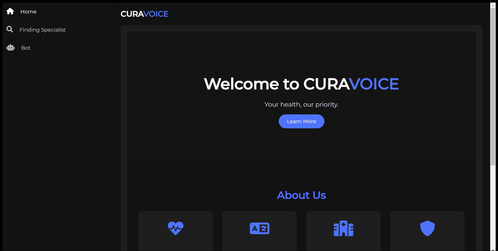
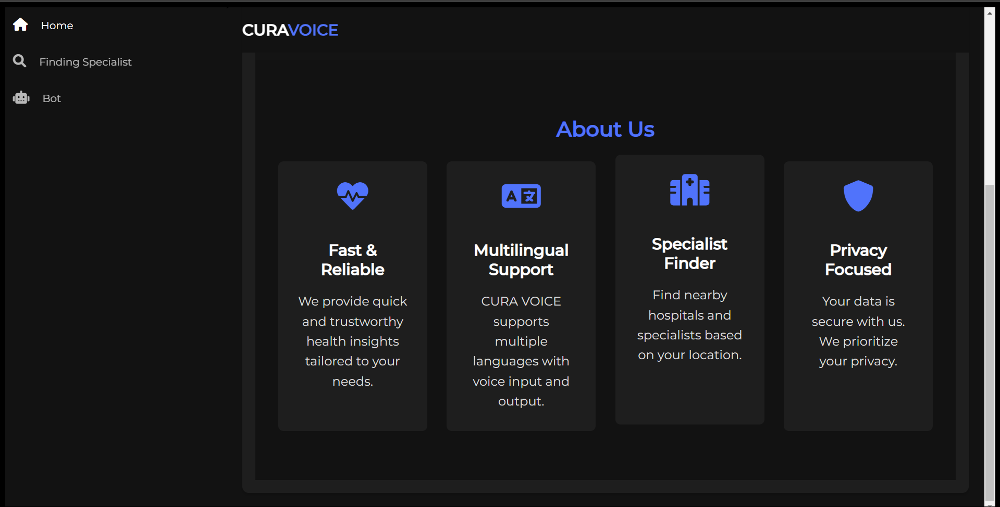
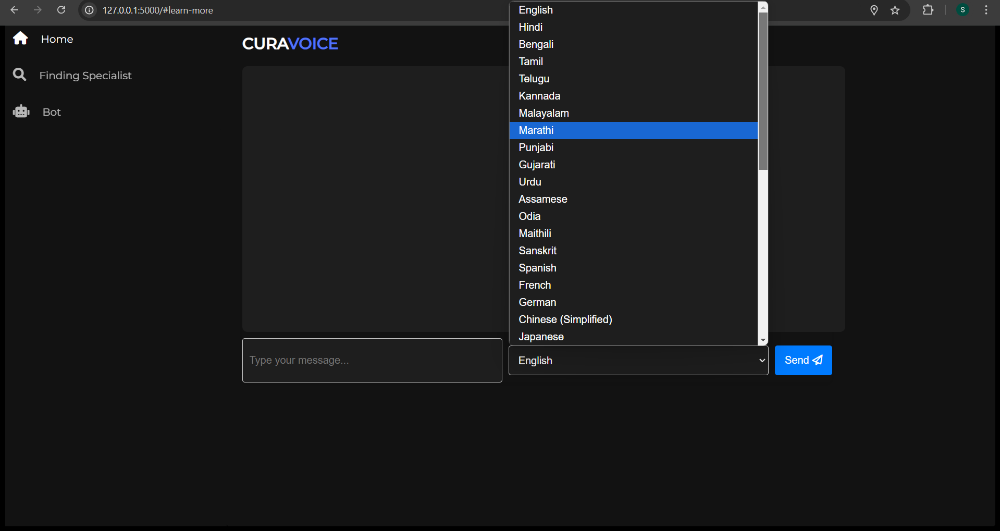
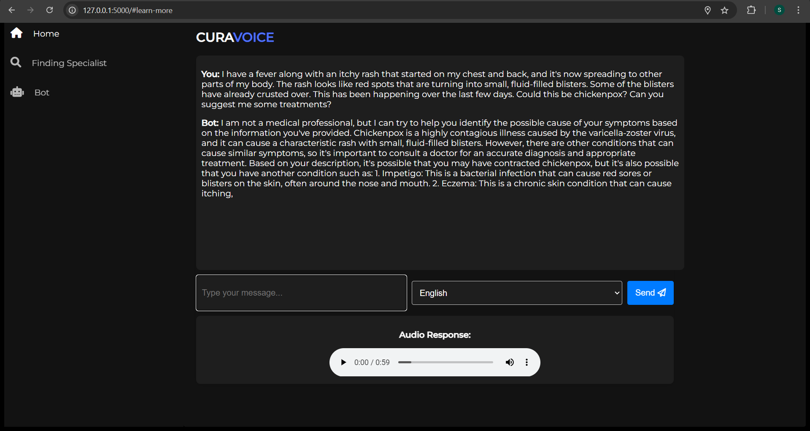
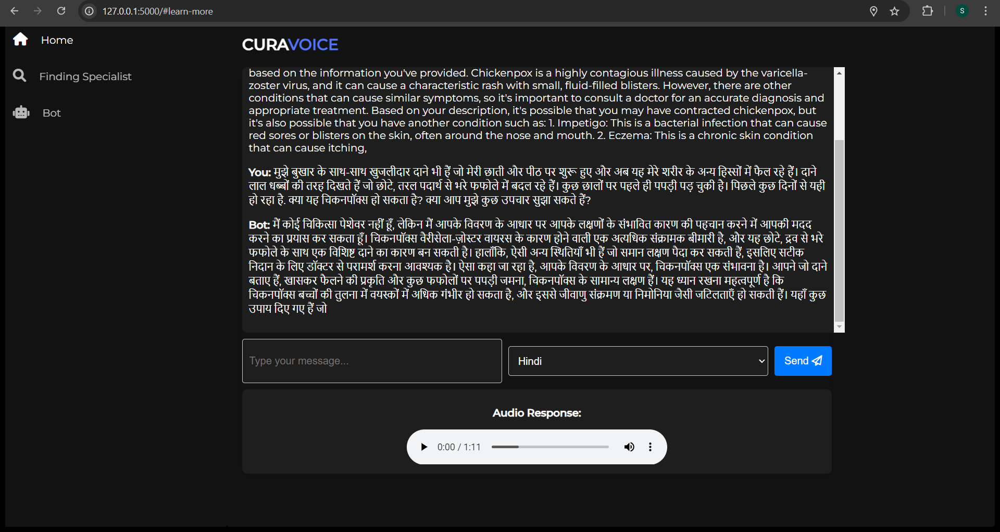
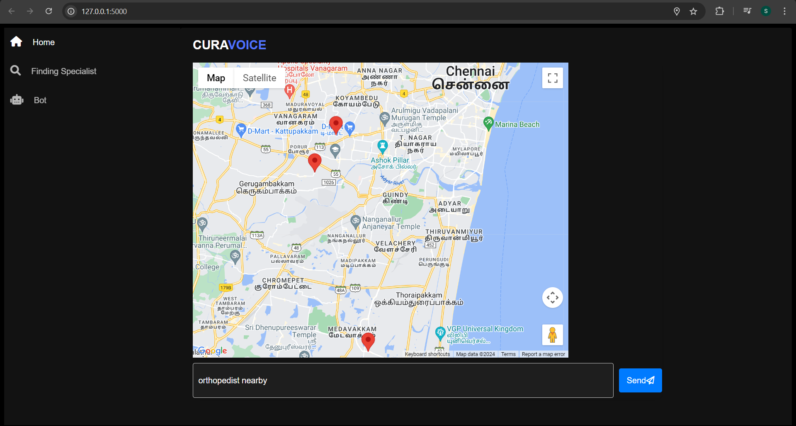

# CuraVoice

CuraVoice is an advanced web-based medical chatbot designed to provide personalized health assistance to users worldwide. Developed by my team Curavoice (Team ID: VIT427) for the Smart India Hackathon (SIH) 2024, CuraVoice addresses critical challenges in accessible healthcare by leveraging cutting-edge technology.

This project was created under the Problem Statement ID – 1597 as part of the Student Innovation category within the MedTech/BioTech/HealthTech theme. It focuses on creating an innovative software solution to bridge gaps in healthcare accessibility. The ppt is attached to the repo.

CuraVoice enables users to input symptoms and receive accurate disease predictions along with treatment recommendations using Large Language Models (LLMs). The application supports a vast range of languages worldwide, with special tuning for Indian languages, ensuring inclusivity and accessibility for diverse linguistic regions.

Key features of CuraVoice include:
+ Multilingual Support: Communicate in any language, globally or regionally.
+ Text-to-Speech Functionality: Converts chatbot responses into audio for all supported languages.
+ Real-Time Specialist Locator: Integrated with Google Maps API to identify nearby hospitals and specialists based on the user’s location.
CuraVoice is your comprehensive solution for accessible and reliable healthcare assistance, designed to empower users with quick, accurate, and multilingual health insights.

## Features
CuraVoice provides a seamless and interactive experience for users with a variety of features designed to simplify healthcare accessibility:
## 1) Home Page

The home page offers an intuitive navigation interface, allowing users to explore the app’s functionalities effortlessly. It provides a welcoming message and introduces the app’s core purpose: prioritizing your health with reliable and accessible solutions.





## 2) Multilingual Chatbot

The chatbot enables users to input symptoms in any supported language and provides accurate disease predictions with treatment recommendations. CuraVoice supports 15 Indian languages, including Hindi, Bengali, Tamil, Telugu, Kannada, and Malayalam, as well as major global languages like Spanish, French, German, Chinese (Simplified), Japanese, and more, ensuring accessibility for users worldwide.







## 3) Text-to-Speech

CuraVoice enhances accessibility by converting chatbot responses into audio using Google Text-to-Speech (gTTS). This feature allows users to listen to responses in their preferred language, making the app more inclusive for users with reading difficulties or language preferences.
Audio examples for the Text-to-Speech feature, one in English and one in Hindi, are included in the assets folder of this repository for reference.

## 4) Specialist Locator

Integrated with Google Maps API, the Specialist Locator allows users to find nearby hospitals and specialists based on their symptoms. It ensures real-time access to reliable healthcare providers in their vicinity.



## LLM

CuraVoice leverages a Large Language Model (LLM) of size 12.5 GB, fine-tuned for medical symptom analysis, disease prediction, and treatment recommendations. The model, optimized using 4-bit quantization with BitsAndBytesConfig, is efficient yet requires a GPU with sufficient VRAM for smooth training and inference. The LLM is pre-trained and further fine-tuned on medical-specific datasets, such as Wiki Medical Terms, using Low-Rank Adaptation (LoRA) to enhance its accuracy for healthcare-related queries.

The model processes multilingual input by translating user queries into English via Google Translator. It generates context-aware responses using a robust text generation pipeline, which are then translated back to the user’s preferred language and optionally converted to speech using Google TTS for accessibility. The LLM directory is specified in app.py and can be downloaded either via the provided Google Drive link or automatically by the app at runtime.

## Installation Guide

## 1) Clone the Repository
Start by cloning the CuraVoice repository to your local machine:

```bash
git clone https://github.com/your-username/CuraVoice.git
cd CuraVoice
```

## 2) Install Dependencies

```bash
pip install -r requirements.txt
```

## 3) Set Up the LLM Model

The LLM model (12.5 GB) is not included in the repository. You can set it up in one of two ways:
+ Manual Download: Download the model files from the provided Google Drive link and place them in the specified directory in app.py.
 https://drive.google.com/drive/folders/1KmryvlhmMDw8thLgE9aRg9ul7FIKJgOK?usp=sharing

+ Automatic Download: Run the app, which automatically fetches the model if not found locally.

## 4) Run the Flask App

Start the Flask server to host the application locally:

```bash
python app.py
```

The app will be available at http://localhost:5000 in your web browser.

## Team Members
1) Shivamm Warambhey (Team Leader) - Built the backend, full project integration, and managed team coordination.
2) A. Chennakeshava Reddy - Designed the front-end interface and handled Map API integration.
3) Aman Amirneni - Led the development of the Large Language Model (LLM) and implemented fine-tuning for medical-specific queries.
4) Koppuravuri Rupesh Venkata Sai Krishna - Assisted in the development of the LLM model and contributed to its implementation.
5) Mohit Anand Pitchika - Assisted in testing the application and helping with debugging tasks.
6) Penumaka Dedeepya - Helped brainstorm ideas, create the presentation for pitching CuraVoice, and contribute to pitching discussions.
